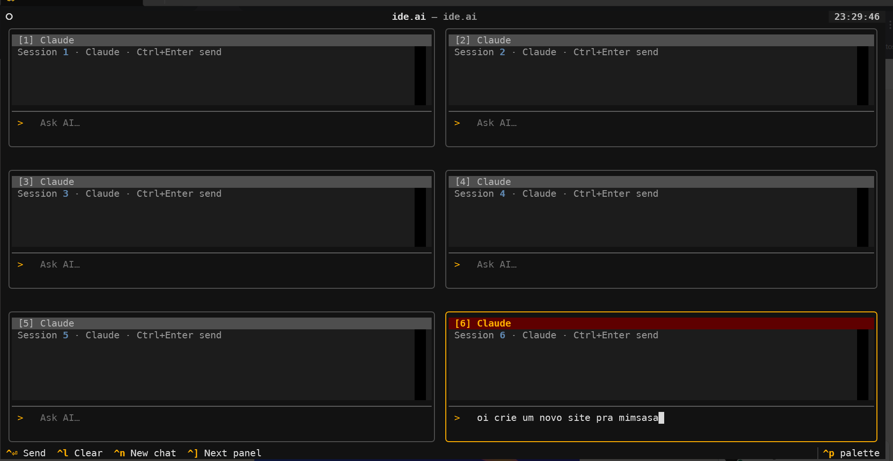
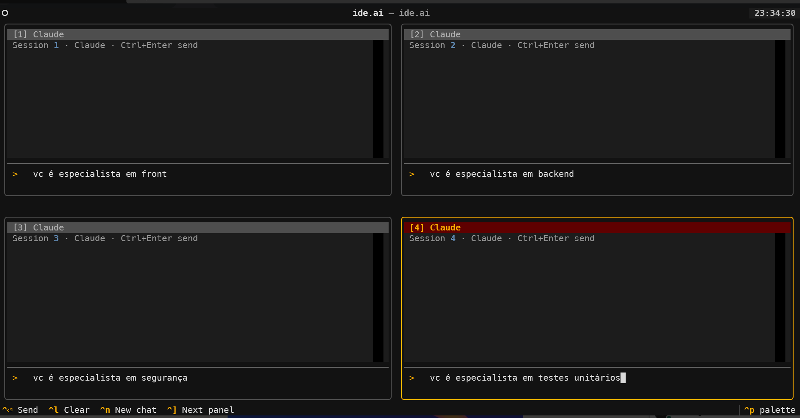
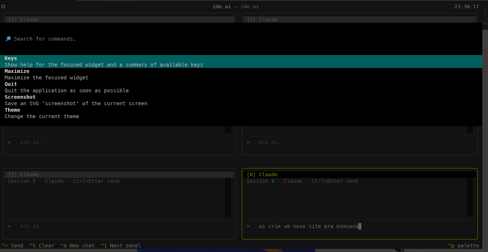

# ide.ai

TUI com múltiplas caixinhas de AI chat no terminal — focado em AI developer experience.
Construído com [Textual](https://github.com/Textualize/textual) + [Rich](https://github.com/Textualize/rich).







---

## 🚀 IDE.AI v2 — New Minimalista Design

IDE.AI v2 introduces a streamlined, chat-focused interface inspired by **Claude Code** and **GitHub Copilot CLI**.

### What's New in v2

- **Chat-First Layout** — Single unified chat panel (no multi-box grid)
- **AI Provider Selector** — Easily switch between Claude and Copilot
- **Minimalista Design** — Reduced visual noise, focus on content
- **Responsive Layout** — Adapts to terminal sizes from 80 to 240+ columns
- **WCAG AA Compliant** — Full accessibility with proper color contrast and keyboard support
- **Rich Keybindings** — VS Code-style shortcuts for fast navigation

### Running IDE.AI v2

```bash
# From source
uv sync
uv run python -m ide_ai.app_new

# Or import directly
from ide_ai.app_new import run
run()
```

### v2 Documentation

Learn more about the v2 design and usage:

- **[DESIGN_SYSTEM_V2.md](DESIGN_SYSTEM_V2.md)** — Color palette, typography, spacing
- **[V2_IMPLEMENTATION.md](V2_IMPLEMENTATION.md)** — Component architecture
- **[STYLE_GUIDE.md](STYLE_GUIDE.md)** — Icon scheme, colors, keybindings, contributing guidelines
- **[RESPONSIVE_QUICK_REFERENCE.md](RESPONSIVE_QUICK_REFERENCE.md)** — Responsive layout guide

---

## Como funciona

Múltiplas sessões de AI chat visíveis ao mesmo tempo, em grade responsiva:

```
╭─ [1] Claude ──────────╮ ╭─ [2] Claude ──────────╮
│                       │ │                       │
│ You: como faço X?     │ │ You: explica Y         │
│ Claude: ...           │ │ Claude: ...            │
├───────────────────────┤ ├───────────────────────┤
│ > Ask AI…             │ │ > Ask AI…             │
╰───────────────────────╯ ╰───────────────────────╯
╭─ [3] Copilot ─────────────────────────────────────╮
│ > Ask AI…                                         │
╰───────────────────────────────────────────────────╯
```

### Responsividade automática

| Largura do terminal | Colunas |
| ------------------- | ------- |
| < 80 chars          | 1       |
| 80 – 159            | 2       |
| 160 – 239           | 3       |
| ≥ 240               | 4       |

## Requisitos

- `claude` CLI (opcional) — `npm install -g @anthropic-ai/claude-code`
- `gh` CLI (opcional, para Copilot) — [cli.github.com](https://cli.github.com)

> **Transparência:** funciona melhor em terminais modernos como **kitty**, **WezTerm**, **iTerm2** ou **Ghostty**.

## Como rodar

### Opção 1: Executável Standalone (SEM Python)

Baixe o executável pré-compilado do [Releases](https://github.com/eltonjncorreia/ide.ai/releases):

#### Linux (com script automático)
```bash
curl -L https://raw.githubusercontent.com/eltonjncorreia/ide.ai/main/install-linux.sh | bash
```

Ou manualmente:
```bash
curl -L https://github.com/eltonjncorreia/ide.ai/releases/download/vX.Y.Z/ide-ai-linux-x64 -o ide-ai
chmod +x ide-ai
sudo mv ide-ai /usr/local/bin/
ide-ai
```

#### Windows (com script automático)
```powershell
Invoke-WebRequest -Uri "https://raw.githubusercontent.com/eltonjncorreia/ide.ai/main/install-windows.ps1" -OutFile "install.ps1"
.\install.ps1
```

Ou manualmente:
```powershell
# Download ide-ai-windows-x64.exe de:
# https://github.com/eltonjncorreia/ide.ai/releases/download/vX.Y.Z/ide-ai-windows-x64.exe

# Executar
.\ide-ai-windows-x64.exe
```

### Opção 2: A partir do código-fonte (COM Python)

Requisitos:
- Python >= 3.10
- [uv](https://github.com/astral-sh/uv) (gerenciador de pacotes recomendado)

```bash
# Instalar dependências
uv sync

# Executar
uv run python -m ide_ai
```

### Compilar você mesmo (BUILD)

```bash
# Instalar dependências
uv sync

# Build (requer PyInstaller)
./build.sh

# Executável gerado em: ./dist/ide-ai (Linux) ou ./dist/ide-ai.exe (Windows)
./dist/ide-ai
```

## Comandos

### v2 — New Keybindings (Minimalista)

| Tecla            | Ação                          |
| ---------------- | ----------------------------- |
| `Ctrl+Q`         | Sair                          |
| `Ctrl+H`         | Mostrar ajuda (Help)          |
| `Ctrl+N`         | Nova conversa (New chat)      |
| `Ctrl+L`         | Limpar conversa (Clear chat)  |
| `Ctrl+Enter`     | Enviar mensagem (Send)        |
| `Ctrl+Tab`       | Próximo provider              |
| `Ctrl+Shift+Tab` | Provider anterior             |
| `Ctrl+E`         | Toggle file tree              |
| `Ctrl+` ` (grave) | Toggle terminal               |
| `Ctrl+Shift+C`   | Adicionar contexto            |

### v1 — Original Keybindings (Multi-box)

#### Gerenciar caixinhas

| Tecla            | Ação                        |
| ---------------- | --------------------------- |
| `Ctrl+N`         | Criar nova caixinha de chat |
| `Ctrl+W`         | Fechar a caixinha ativa     |
| `Ctrl+]`         | Ir para a próxima caixinha  |
| `Ctrl+[` / `Esc` | Ir para a caixinha anterior |
| `Ctrl+Q`         | Sair                        |

#### Dentro de cada caixinha

| Tecla          | Ação                                |
| -------------- | ----------------------------------- |
| `Ctrl+Enter`   | Enviar mensagem para a AI           |
| `Ctrl+L`       | Limpar histórico do chat            |
| `Ctrl+Y`       | Alternar provider: Claude ↔ Copilot |
| `Ctrl+Shift+C` | Copiar última resposta              |
| `Ctrl+Shift+A` | Copiar toda a conversa              |

## Estrutura

```
ide.ai/
├── main.py
├── src/
│   └── ide_ai/
│       ├── app.py               # IdeApp — entry point
│       ├── app.tcss             # Estilos (grid, caixinhas, transparência)
│       ├── layout/
│       │   └── panel_grid.py    # Grade responsiva de caixinhas
│       ├── panels/
│       │   └── chat_box.py      # ChatBox — caixinha individual
│       └── ai/
│           ├── base.py          # AIProvider interface
│           ├── claude.py        # ClaudeProvider (subprocess `claude`)
│           └── copilot.py       # CopilotProvider (subprocess `gh copilot`)
├── pyproject.toml
└── uv.lock
```
